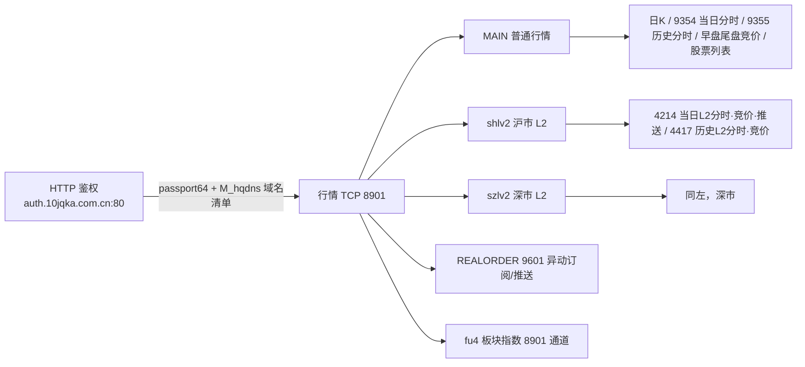

# 同花顺行情协议与 thspypc 实现指南

> 目标：读这一份文档就能理解 thspypc 如何登录、如何向哪台服务器发送什么请求、如何解析响应，
> 以及各功能在源码里的位置，无需再逐行翻源码。需要精确到字节时，再按“代码地图”进入对应文件。
>
> 适用范围：A 股（沪深）免费 PC 行情。日期基准：2026-08-01，协议以同花顺 PC 客户端抓包逆向为准。
> 2026-08-01 增补：系统板块（行业/概念板块指数、成分股）通道与协议、历史分时 packed-date 游标修正。

---

## 1. 系统总览

thspypc 是一条**三层链路**：



三层职责：

1. **HTTP 鉴权**（`src/thspypc/features/auth_protocol.py`、`src/thspypc/protocol.py`）：账号密码/二维码换 `Passport64`，
   并拿到服务器域名清单 `M_hqdns`。鉴权不建立行情连接。
2. **行情 TCP 8901**（`src/thspypc/_transport/`、`src/thspypc/_client/connection_primitives.py`）：
   每类服务器各自 `login → init → 请求/响应`，连接按角色（MAIN / SH_L2 / SZ_L2 / REALORDER /
   BOARD / BOARD_CONSTITUENT_SH / BOARD_CONSTITUENT_SZ）复用，
   带单飞锁、心跳和失败治理。
3. **业务协议**（`src/thspypc/features/*_protocol.py`）：请求是 **GBK 文本行**（`CodeList/DataType/DateTime/pageid`），
   响应是 **hd1.0 / hd3.1 二进制表**，部分响应外层还有 8901 LZ77 压缩。

---

## 2. 帧封装与压缩（公共编解码）

所有 8901/9601 消息都包一层 FDF 信封（`src/thspypc/codecs/framing.py`）：

```text
FD FD FD FD | 8 位 ASCII hex 帧长 | body
```

- 发送：`encode_frame(body)`，调用方通常再追一个 `\n`。
- 接收：`read_frame()` 扫描 magic → 读 8 字节长度 → 读 body；兼容服务器偶发“第 5 个 FD”
  和帧头前的 `\x00`。

**8901 外层压缩**（`src/thspypc/codecs/compression.py`）：部分响应（尤其 `cmd=0x0a` 的沪市帧）
整体是 LZ77 变体压缩（64K 哈希字典 + 滑动窗口），解析前先调
`normalize_8901_response(body)` 解压，再找业务标记。

**两种业务表结构**：

| 标记 | 用途 | 结构 |
|---|---|---|
| `hd1.0` | 竞价、历史分时 | `record_count(4B) flag(2B) record_size(2B) field_count(2B)` + 字段表(`field_count×4B`) + 壳段 + 定长记录 |
| `hd3.1` | 当日分时、K线、部分当日尾盘 | 同上表头，但记录区是 **BitRLE 位平面**：先 `_decode_bitrle_0x13746d0` 解出位平面，再 `_transpose_bitplane_0x1763410` 转置成行 |

字段表每项 4 字节：`datatype(1B) fmt(1B) flags(1B) width(1B)`。记录里 `dt<datatype>` 就是“第几个字段”，
宽 4 的按 THS float 解码（`decode_ths_float`），非 4 字节的保留 `dt<id>_raw`。

---

## 3. 账号类型、权限与能力模型

### 3.1 账号类型（`src/thspypc/models.py`、`features/account_profile.py`）

| 类型 | passport 判定（两者同时满足才成立） | 说明 |
|---|---|---|
| `STANDARD` 普通 | `userclass=10000` 且 `level2=255` | 走 MAIN，基础行情，**不发、不解析** L2 大单字段 |
| `LEVEL2` | `userclass=30002` 且 `level2=16;32;48` | 走 shlv2/szlv2，可用 4214/4417 |
| `UNKNOWN` | 其他组合 | 保守拒绝进特权通道，报 `UnsupportedAccountFeatureError` |

判定原则：**单一字段不构成证据**，未验证的组合一律 `UNKNOWN`，防止普通账号被误路由到 L2 通道。

### 3.2 能力（Capability）与三态 Support

每个业务都对应一个 `Capability`，只有证据为 `YES` 才放行：

| 通道 | 能力 |
|---|---|
| MAIN | `BASIC_QUOTE`、`BASIC_TIMELINE`、`BASIC_HISTORY_TIMELINE`、`BASIC_AUCTION` |
| SH_L2 / SZ_L2 | `L2_MARKET_ACCESS`（进通道前提）+ `L2_TIMELINE`、`L2_AUCTION`、`L2_HISTORY_TIMELINE`、`L2_SNAPSHOT_PUSH` |
| REALORDER 9601 | `REALORDER`、`REALORDER_BASIC_ANOMALIES`、`REALORDER_LEVEL2_ANOMALIES` |

`Support` 三态：`YES` 放行；`NO` 抛 `CapabilityUnavailableError`；`UNKNOWN` 抛
`UnsupportedAccountFeatureError`。证据由 `AccountEvidenceRecorder` 在真实业务成功后逐步沉淀，
“域名能连上 / 登录成功”本身不算授权证据。

> 系统板块不设独立 Capability 枚举，由 `ConnectionRole.BOARD` 连接角色门控；L2 侧成分股
> 连接复用 `L2_MARKET_ACCESS` 能力门禁（`board_constituents` 会显式请求该能力，成功后回填
> `l2_market_init/manual_login` 证据，后续调用不再依赖账号是否开过 L2 推送连接）。

---

## 4. 登录流程

入口：`client.authenticate()`（只做 HTTP 鉴权）、`client.connect_main()`（鉴权 + MAIN 连接，
`connect()` 是它的兼容别名）、`connect_with_qrcode()`、`connect_cached()`。

### 4.1 HTTP 三步鉴权（`protocol.full_http_auth`）

```text
fetch_rsa_pubkey()          # 取 RSA 公钥
  → http_unified_login()    # 账号密码 → userid / sessionid
  → http_mainverify()       # userid+sessionid+imei → Passport64（含 M_hqdns 服务器清单）
```

`imei`（32 位十六进制设备指纹）与 `Mac64` 均由算法本地生成（`generate_imei`），可完全脱机运行。

### 4.2 TCP 8901 login（`_client/connection_primitives.py`）

1. 从 `M_hqdns` 解析候选域名：MAIN 只取 `main.123ths.com`（缺失时回退 `ifindhq.123ths.com`），
   L2 只取 `shlv2.123ths.com` / `szlv2.123ths.com`（`resolve_market_hosts` / `resolve_l2_hosts`）。
2. **并发 TCP 测速**选最快 IP，再**并发向多个 IP 发 login 帧**，取第一个 `VerifyCode=0` 的连接，
   其余关闭——复刻 hexin 策略，避免串行重复 login 触发 `VerifyCode=-1` 会话冲突。
3. login 帧（`features/auth_protocol.build_login_body`）：

   ```text
   09 41 09 00 zh_CN.GBK <check> 09
   Ask=login
   C-Version=...
   UserName=thsuser          # 普通身份（__manual 身份保留在 MANUAL 分支）
   Password=thsuser
   VerifyType=1
   Mac64=...
   C-SupportPushVer=1.0
   C-SupReqDataVer=hq6.0
   C-SupPushDataVer=hq6.0
   Passport64=<HTTP 鉴权所得>
   ```

4. 响应为文本字段（`parse_login_response`）：`VerifyCode=0` 成功；`-1` 多为同 IP 短时重复
   登录的会话冲突（level2 单点登录），换 IP 即恢复，不是封禁；连续 5 个 IP `-1` 提前放弃并
   返回 `session_conflict`。
5. **板块通道（fu4）登录壳走身份回退链**：`_open_board_channel` 对每个 IP 按
   `BOARD → STANDARD → MANUAL` 顺序尝试（2026-08-01 实测 L2 三种壳都接受；普通账号偶发对
   `__manual`/无用户名壳回 `PromptText=-6`，`thsuser` 壳通过）。真实客户端抓包的 BOARD 壳
   是唯一基准：Level2 无 UserName/Password（suffix=计算 check+09，抓包 `aa 09`）；普通账号
   `UserName=__manual`（`\r\n\n` 分隔，suffix 固定 `5e 07`）。

### 4.3 init 握手（`build_init_query` / `parse_init_response`）

login 成功后必须紧跟 init（subtype `0x0001`），激活行情查询通道；**跳过 init 直接查 K线会超时**
（list_quotes 不依赖 init，容易掩盖此问题）：

| 通道 | init 内容 | 期望响应 |
|---|---|---|
| MAIN | 标准 init | 服务器配置帧 ~49KB（S-OS/S-Version/SName），0.1s 返回 |
| shlv2 | `MarketCode=16;144;` | 配置帧 23KB+；<5000B 视为该 IP 未激活，换 IP |
| szlv2 | `MarketCode=32;` | 同上；深市必须连 szlv2（MAIN 节点对 L2 只回 210B 小帧） |
| BOARD（fu4） | `MarketCode=96;128;88;216;48;`（含 MarketDate/StockLinkVer） | 引导是逐帧流水（subreal 注册 → init → qureal-init → 分类表 → StockNameVer），见 11 节 |

### 4.4 登录后

- MAIN/REALORDER 启动心跳线程（`build_heartbeat_8901`）。
- 能力证据写入 `AccountEvidenceRecorder`，路由 profile 随证据升级。
- 连接治理：`connect_main` 距上次成功 <20s 且连接存活时直接复用；K线失败 IP 进黑名单；
  L2 连接建立时会短暂占用主连接（`_drop_main`），故竞价/分时脚本期间不同时跑其他查询。

---

## 5. 服务器矩阵与权限

详细版见 `docs/architecture/SERVER_MATRIX.md`。已实现角色：

| 角色 | 地址 | 登录/init | 权限前提 | 已验证用途 |
|---|---|---|---|---|
| HTTP | `auth.10jqka.com.cn:80` | 三步鉴权 | 有效账号/二维码 | passport、signature、M_hqdns |
| MAIN | `main.123ths.com:8901`（优先）/ `ifindhq.123ths.com:8901`（回退） | 普通登录 + 标准 init | `BASIC_*` | 日K、9354 当日分时、9355 历史分时、早盘/尾盘竞价、股票列表、批量行情 |
| SH_L2 | `shlv2.123ths.com:8901` | Level2 passport + thsuser 壳；init `16;144;` | `L2_MARKET_ACCESS` + `L2_*` | 沪市 L2 分时、竞价、快照推送、历史分时 |
| SZ_L2 | `szlv2.123ths.com:8901` | 同左；init `32;` | 同左 | 深市 L2 同左 |
| BOARD | `fu4.123ths.com:8901` | 板块壳（身份回退链 BOARD→STANDARD→MANUAL）；引导 subreal URS/UCT/UNX/UCX/UME → `MarketCode=96;128;88;216;48;` → qureal-init×10 → `[5],[55]` 分类表 → StockNameVer | `ConnectionRole.BOARD` | 板块行情/分时/竞价（仅板块指数，不做成分股） |
| BOARD_CONSTITUENT_SH/SZ | 沪 `shlv2.123ths.com:8901` / 深 `szlv2.123ths.com:8901`（普通账号走 `main.123ths.com:8901`） | 股票网关身份（沪 `thsuser` / 深 `__manual`）；MKT_INIT 用股票市场集（`16;144;` / `32;` / `16;32;144;`）+ 两轮 subreal/pageid | `L2_MARKET_ACCESS`（L2 侧） | 按板块查成分股（881121 双账号 176 条，约 4-5s） |
| REALORDER | 固定 seed `106.14.65.90:9601`（官方客户端可缓存动态节点） | 独立 9601 登录 | `REALORDER` | 异动历史/订阅/推送 |

路由约束：

- MAIN 只从 `main`/`ifindhq` 解析 IP；`fu4/hkus/euhq` 等域名能登录但不响应沪深基础行情，禁止混入。
- shlv2 与 szlv2 是两套不重叠的 IP 池；沪票连 shlv2、深票连 szlv2，`MarketCode` 必须匹配。
- L2 业务（4214/4417）**禁止回退到 MAIN 9354/9355**；深市 4417 走 MAIN 只回短帧。
- 板块指数只能走 fu4；**成分股独立连接必须走股票行情网关**（普通 main / L2 沪 shlv2 /
  L2 深 szlv2），连错到 fu4 `globalthsindex-gateway` 时全部 subreal 注册回 `errorcode=-1`，
  业务查询只回 26B 空 Sort 响应（2026-08-01 复盘，见 11.5）。
- DNS 会轮换，文档/代码中的 IP 只是某次观测，运行时应实时解析 `M_hqdns`。

---

## 6. 业务请求速查总表

请求头固定 23 字节：`hdr[0]=0x09`；`hdr[5:7]=seq`；`hdr[7:11]=0x12 00 09 00`；
`hdr[11:13]=route`；`hdr[17]/hdr[18]` 为标志/周期高位；`hdr[19:23]=文本长度`。
文本行首尾是 `\r\n`，编码 GBK。

| 业务 | 账号 | pageid | period | DataType | 连接 | 响应 |
|---|---|---|---|---|---|---|
| 当日分时 | 普通 | 9354 | 8192(0-0) | 10 字段 | MAIN | hd3.1 241 行 |
| 当日分时 | L2 | 4214 | 8192(0-0) | 31 字段 + 基准指数 | shlv2/szlv2 | hd3.1 |
| 历史分时 | 普通 | 9355 | 8192(bar起-止) | 18 字段 | MAIN | hd1.0 7 字段表 |
| 历史分时 | L2 | 4417 | 8192(bar起-止) | 26 字段 | shlv2/szlv2 | hd1.0 23 字段表 |
| 早盘竞价 | 普通 | 9354 当日 / 9355 历史 | 7176 / 6144 | 10,27,33,49 | MAIN | hd1.0 |
| 早盘竞价 | L2 | 4214 当日 / 4417 历史 | 7176 / 6144 | 10,27,33,49 | shlv2/szlv2 | hd1.0 |
| 尾盘竞价 | 普通 | 9354 当日 / 9355 历史 | 7424 | 10,49,287 | MAIN | hd1.0/hd3.1 |
| 尾盘竞价 | L2 | 4214 当日 / 4417 历史 | 7424 | 10,49,287 | shlv2/szlv2 | hd1.0（历史）/ hd3.1（当日） |
| 日K | 任意 | 9355 | 0x4000(-count-0) | 7,8,9,11,13,19 | MAIN | hd3.1 |
| 周K | 任意 | 9355 | 0x5001(-count-0) | 同左 | MAIN | hd3.1 |
| 月K | 任意 | 9355 | 0x6001(-count-0) | 同左 | MAIN | hd3.1 |
| 分钟K | 任意 | 9355 | 0x3005/0x300F/0x301E/0x303C | 同左 | MAIN | hd3.1 |
| 板块行情列表 | 板块通道 | L2 5716/1341 · 普通 392 | 8192 | 见 11.2 | fu4 | hd3.1 0x130 |
| 板块指数分时/竞价 | 板块通道 | L2 6002 · 普通 4181 | 8192(packed) / unix 区间 | 见 11.2 | fu4 | 0x42 / 0x32 |
| 板块成分股 | 成分连接 | L2 6000 · 普通 4180 | 8192 | 见 11.2 | main/shlv2/szlv2 | hd3.1 0x64 |

> 竞价类请求的 `DateTime` 两个参数是 **unix 时间戳区间**（如 9:15-9:25）；分时/历史分时是
> **bar 游标区间**；K线是 **`-count-0` 回溯窗口**。三者语义不同，勿混用。

---

## 7. 当日分时（`timeline`）

客户端入口：`client.timeline(code, market=...)` → `TimelineService.timeline` →
`select_timeline_plan` 按账号自动选 BASIC/LEVEL2。

### 7.1 普通账号（MAIN 9354）

请求文本（`features/timeline_protocol.py build_timeline_query`，两段子帧流水线）：

```text
CodeList=33(000938,);
DataType=14,13,19,54,10,23,15,22,6,45,
DateTime=8192(0-0)
LackTime=0,3,0,0,0,0,0,0
pageid=9354
```

companion 子帧（route 0x0100，DataType 26 个 companion 字段，`DateTime=0(0-0)`）。
主请求子帧 route `0x010A`，`history_flag=0x20`。

响应：`hd3.1`（flag `0x0042/0x0046`，`record_count=241`），`parse_timeline_response` 先解 8901
外层再解析。字段示例：`time`、`dt10`(现价)、`dt13`(成交量)、`dt19`(成交额)、`dt14`(主动买量)…

### 7.2 Level2 账号（4214）

请求文本（`build_timeline_l2_query`，route `0x0201`，`hdr[18]=0x20`，seq 高字节 `0x10`）：

```text
CodeList=32(399002,);33(000938,);      # 深市自动带基准指数；沪市为 16(1A0002,)
DataType=1,16,229,14,207,15,228,13,227,19,40,226,54,18,204,39,225,10,203,210,38,224,23,202,209,223,230,15,22,201,208,
DateTime=8192(0-0)
LackTime=0,3,0,0,20031231,2,0,0
pageid=4214
```

关键点：

- 必须先通过 `L2SubscriptionCoordinator.ensure_registered` 在对应市场 L2 连接上注册 4214
  订阅（普通身份发同样的订阅帧会 `CodeListSize=0`）。
- 31 个 L2 字段含 `dt201-230` 大单金额双线（`dt227/dt229`=主动买/卖额，差值为主力净额曲线）。
- 解析入口 `parse_timeline_l2_response`；深市必须连 szlv2。

---

## 8. 历史分时（`history_timeline`）

客户端入口：`client.history_timeline(code, date, market=...)`；非交易日/当天之外一律走历史页。

### 8.1 普通账号（MAIN 9355）

请求（`build_normal_history_timeline_query`，两段子帧）：

```text
# 段1 prefix：subtype 0x0002, route 0x006C
CodeList=33(000938,);
pageid=9355

# 段2 query：subtype 0x0009, route 0x016C, history_flag
CodeList=33(000938,);
DataType=207,13,19,54,204,10,203,210,23,202,209,22,201,208,6,1110,407,1111,
DateTime=8192(132479582-132479937)      # packed-date 游标（两账号统一）
DTPrevOff=-367
LackTime=0,3,0,0,0,0,0,0
pageid=9355
```

bar 游标用**打包日期**编码：`(year-1900)<<9 | month<<5 | day`，再 `×2048 + 606`
（`date_to_normal_timeline_bar`）。响应为 `hd1.0` 普通表：flag `0x0042`、`hs=28`、`fc=7`，
每行 `bar_index + dt10/13/19/22/23/54`（基础价量额）。

**请求模式（2026-08-01 修正）**：客户端分时窗口放大后走 route `0x006C`，服务端回**全量 241 点**；
窗口较小时走 route `0x007A` 稀疏模式，服务端只下发部分分钟（实测 07-23 201/241、06-30 185/241，
多张 0x42 表、行乱序）。`build_normal_history_timeline_query` 恒走 0x6C 全量；抓包复现历史分时
前务必先把分时窗口放大/最大化。

### 8.2 Level2 账号（4417）

请求（`build_history_timeline_query`，三段子帧流水线）：

```text
# 段1 prefix：subtype 0x0002, route 0x0058（深） / 0x007C（沪）
CodeList=33(000938,);
pageid=4417

# 段2 full：subtype 0x0009, route 0x0100|base, history_flag
CodeList=32(399002,);33(000938,);       # 深市个股自动带基准 399002；沪市不带
DataType=229,207,228,13,227,19,226,54,204,225,10,203,210,224,23,202,209,223,230,22,201,208,6,1110,407,1111,
DateTime=8192(132477534-132477889)      # packed-date 游标
DTPrevOff=-61
LackTime=0,3,0,0,0,0,0,0
pageid=4417

# 段3 tail：subtype 0x0002, route 0x0200|base
CodeList=32(399002,);
pageid=4417
```

bar 游标与普通账号一样用 **packed-date 编码**（`(year-1900)<<9 | month<<5 | day) × 2048 + 606`）。
2026-08-01 抓包铁证：07-23 请求游标 `132627038 = packed(07-23)`；旧 ordinal 公式只在
05-13/14、07-24 等日期巧合一致（07-23 会误标成 07-26）。`build_history_timeline_query` 内部统一
调用 `date_to_normal_timeline_bar`；`date_to_timeline_bar`（ordinal）仅保留给竞价 4417 上下文
预热兼容。241 个交易点的偏移固定为 `0..29, 34..93, 98..128, 227..285, 290..349, 354`。

响应为 `hd1.0` Level2 表：flag `0x007E/0x0082`、`hs=88/92`、`fc=22/23`。解析器
（`parse_history_timeline_response`）按字段表动态取值，用 bar 锚点定位物理行（不按固定步长硬切），
得到 23 字段：

2026-08-01 确认：L2 4417 响应体恒含**两张表**——`0x007E`（基准 399002/1A0002，22 字段、无 dt54）
+ `0x0082`（目标股，23 字段、含 dt54），且恒为全量 241 点（无 0x7A 稀疏模式）。

`bar_index, dt10, dt13, dt19, dt22, dt23, dt54, dt201-204, dt207-210, dt223-230`

- `dt10` 价格、`dt13` 累计成交量、`dt19` 累计成交额；
- `dt54` 历史分时为 `0xFFFFFFFF` 哨兵 → 0.0；
- `dt201-230` 为 Level2 大单金额双线（`dt227/dt229`=主动买/卖额累计，差=主力净额曲线）。

> 历史分时 241 点只覆盖盘中。早盘竞价、尾盘竞价需要单独请求（见 9/10 节），
> `client.intraday()` 会把三段合并。

---

## 9. 早盘竞价（`auction`，9:15-9:25）

客户端入口：`client.auction(code, trade_date=...)` → `AuctionService.auction`。

### 9.1 普通账号（MAIN）

`build_basic_auction_query`：当日 `pageid=9354/period=7176`，历史 `pageid=9355/period=6144`；
route `0x0100`，`hdr[18]=period>>8`：

```text
CodeList=33(000938,);
DataType=10,27,33,49,
DateTime=6144(1784855700-1784856300)    # 历史：9:15-9:25 unix 时间戳
LackTime=0,0,0,0,0,0,0,0
pageid=9355
```

### 9.2 Level2 账号（shlv2/szlv2）

- 当日：`build_auction_query`，`pageid=4214/period=7176`，route 字节 `fc 01`，
  `hdr[15]=0x40、hdr[17]=0x08、hdr[18]=0x1C`，seq 高字节 `0x01`。
- 历史：`build_l2_history_auction_query`，`pageid=4417/period=6144`；但服务层
  （`_build_l2_history_auction_bundle`）会把三条请求用 `\n` 流水线一次发出（复刻 PC 客户端）：

  ```text
  ① 历史分时上下文（pageid=4417，日期=目标日的下一个工作日，seq 0x10EC）
  ② 尾盘竞价   （pageid=4417，period=7424，seq 0x00EF）
  ③ 早盘竞价   （pageid=4417，period=6144，seq 0x00F1）
  ```

  `auction()` 读帧时用 9:15-9:25 窗口过滤出早盘结果；`closing_auction()` 用 14:57-15:00 窗口。

### 9.3 响应字段

`parse_auction_response`（hd1.0，字段表 `fc=5`）：

| 字段 | 含义 | 备注 |
|---|---|---|
| `time`（dt1） | unix 秒 → datetime | 9:15:00-9:24:57，沪 3 秒/深 9 秒一个 tick |
| `dt10` | 撮合价（虚拟开盘价） | |
| `dt49` | 累计竞价量（股，÷100=手） | |
| `dt27` | 买方未匹配量 | 撮合被动方被吃光时为哨兵 → `None` |
| `dt33` | 卖方未匹配量 | 同上，每 tick 恰好一侧为 None |

沪市原始响应可能走 `cmd=0x0a` 外层压缩或变体壳，由 `_parse_auction_sh` 兜底。

---

## 10. 尾盘竞价（`closing_auction`，14:57-15:00）

客户端入口：`client.closing_auction(code, trade_date=...)`。

- 普通账号：`build_basic_auction_query(closing=True)`，当日 `9354` / 历史 `9355`，`period=7424`。
- Level2：`build_l2_closing_auction_query`，当日 `4214` / 历史 `4417`，`period=7424`；
  历史同样走 9.2 的三条流水线 bundle。
- DataType 固定 `10,49,287,`；DateTime 为 `7424(14:57 时间戳-15:00 时间戳)`。

响应（`parse_closing_auction_response`）：

- 历史 4417：`hd1.0`，flag `0x0036`、`hs=16`、`fc=4`，字段 `[1,10,49,31]`
  （`time/dt10/dt49/dt31`）。
- 当日 4214：可能是 `hd3.1` BitRLE，同一解析器两条分支都处理。
- **容错**：历史帧末条记录固定被截断 1 字节 → 补零保留收盘点；`record_count` 声明多 1 时，
  遇时间戳出窗即停（保留已解记录）。

实测节奏：沪市约 61 点（3s/tick），深市约 20-21 点（9s/tick）——市场真实节奏，非 bug。

---

## 11. 系统板块（`system_blocks`）

系统板块 = 行业/概念板块发现、成分股、板块指数（行情/分时/竞价）。**数据源决策（2026-08-01）**：
全程以抓包同花顺 Windows 客户端的 8901 数据形式为准，不用 `basic.10jqka.com.cn` 网页接口兜底；
本地 `BlockUpdate/block_*.ini` + `industry.ini`（block_hq 缓存）只作**离线 oracle**（稳定 ID /
名称/成分股真值），不是查询路径。

### 11.1 通道与路由（双账号抓包铁证）

| 业务 | 通道 | 说明 |
|---|---|---|
| 板块指数（行情/分时/竞价） | 专用板块通道 `fu4.123ths.com:8901` | 独立 `ConnectionRole.BOARD`；在 MAIN 上原样重放引导帧只回 `CodeListSize=0` |
| 成分股 | 股票行情网关：普通 `main.123ths.com` / L2 沪 `shlv2.123ths.com` / L2 深 `szlv2.123ths.com` | 独立连接角色 `BOARD_CONSTITUENT_SH/SZ`；连错到 fu4 `globalthsindex-gateway` 时全部 subreal 注册回 `errorcode=-1`、业务只回 26B 空 Sort |

板块通道引导序列（`features/system_blocks_protocol.py`，分三阶段发送、阶段间 0.2-0.6s、每帧后带
`0x0a`）：subreal 注册（URS/UCT/UNX/UCX/UME，pageid L2=5716 / 普通=392）→ pageid 注册 →
`MarketCode=96;128;88;216;48;` init（含 MarketDate/StockLinkVer）→ qureal-init×10（instid
0xE0000/0x290000 起、步长 0x20000）→ `DataType=[5],[55]` 分类表 → StockNameVer（L2 双子帧 /
普通 upstockname）。**板块指数统一 `market=48`**（881xxx 行业指数 / 885xxx、886xxx 概念指数）。

成分股引导（独立连接）：普通账号 `thsuser` + MKT_INIT `MarketCode=16;32;144;`；L2 沪 `thsuser`
+ `16;144;`；L2 深 `__manual` + `32;`；subreal class 后缀普通账号为 `UNSI/UHII`。普通账号流程：
先等 Sort 代码页（`SortBegin=0`）→ 发 527527 → 完整字段；L2 不分页，把整市场 universe 按沪/深
两条连接下发（0x64 表；一帧可含多张 hd3.1 表，解析器会扫描后续表）。

### 11.2 请求与响应

板块指数请求为双子帧（前缀 CodeList+pageid + 查询 DataType/DateTime/LackTime/pageid），历史分时
用 packed-date 游标。账号差异只体现在 pageid：

- Level2：`5716/1341`（板块列表+当日分时）、`6000`（成分股+当日分时）、`6002`（板块历史分时/K线/竞价）；
- 普通：`392`（板块列表）、`4180`（成分股+当日分时）、`4181`（历史分时/K线/竞价）。

| 响应表型 | 行宽 | 字段 | 业务 |
|---|---|---|---|
| `0x130` | 344B | dt5(16B 代码)、dt55(20B GBK 名称)、dt6/7/8/9/10/13/19…（dt5/dt6 出现两次，取首次） | 旧版兼容：板块详情页相关行业/概念板块的周期行情推送 |
| `0x64` | 95B | dt5(7B 代码)、dt215…dt66 共 21 字段 | 板块成分股行情 |
| `0x42` | 28B | dt1/10/13/19/22/23/40 | 板块指数分时（242 点/日，dt1=packed bar 游标） |
| `0x32` | 12B | dt1(unix 秒)/10/49 | 板块集合竞价 |

> **2026-08-02 实测修订**（`system_blocks_20260802_*.pcap`）：
> - 板块列表查询（普通 pageid=392）前缀/查询子帧路由为 **0x006C/0x016C**
>   （L2 5716 为 0x0052/0x0152），查询子帧**不带** history flag（字节 17=0x00），
>   `LackTime=0,0,0,0,0,0,0,0`，seq=0x01C4/0x0068。08-01 跨机抓包中的
>   旧列表形态为 0x0039/0x0139、同样无 history flag 且 LackTime 全 0；同路由
>   另有 `DataType=527527`、history flag、`LackTime=0,3,…` 的独立请求，不能混为
>   一个“旧形态”。当前服务端对旧列表形态静默不回复。列表直接响应是
>   0x20/0x1c/0x22 紧凑表（513 行，无名称列）。
> - `0x130` 是响应表 flag，不是请求 opcode。08-01 抓包逐码对齐显示，它由
>   pageid=4180/4181 板块详情页的相关行业/概念板块批量查询触发：服务端周期推送
>   “请求代码 + 当前板块”组成的 0x130 名称行情表，不是 pageid=392 列表请求的
>   直接响应。客户端同时上报了非零 StockLinkVer/StockNameVer，因此触发它不需要
>   删除本地 `BlockUpdate/*.ini` 或 `industry.ini`。
> - 0x42 表有**两种用途**：分时字段集 [1,10,13,19,22,23,40]（242 点/日）与
>   日K 字段集 [1,7,8,9,11,19,13]（DateTime=16384，dt1=YYYYMMDD，596 根/次）；
>   `parse_board_timeline_response` 按字段集区分，日K 走
>   `parse_kline_hd3_response`。
> - 竞价请求 08-02 实测为单查询子帧（pageid=6000/6002，route 0x01FC，
>   h17=0x1C，LackTime 全 0）；与 08-01 双子帧形态的差异仍需同环境受控复验。

稳定 ID：行业 `881xxx`（与 `q.10jqka.com.cn/thshy` 同源）；概念/地域为十六进制 block_id（如
`C024`=BC电池）；概念板块在 8901 中的代码域为 885xxx/886xxx（已见 9354/9355 带 881xxx/885xxx/
886xxx 代码列表的请求样本）。

### 11.3 本地离线 oracle（`features/system_blocks.py`）

| 文件 | 内容 |
|---|---|
| `BlockUpdate/block_2B.ini` | 概念板块：hex block_id → 名称 + 成分股（`17:688981,-105:920045` 格式，~390 个） |
| `industry.ini` | 同花顺行业：881xxx → 名称 + 成分股（~90 个） |
| `BlockUpdate/block_tree.ini` | 板块树：根 `[@10001]` → 分类根（2B 概念 / 47 地域 / 7 港股…）→ 分组/叶子 |
| `BlockUpdate/block_47.ini` 等 | 地域/港股/基金/指标股等分类 |

### 11.4 门面与代码位置

- 离线缓存门面（无需登录）：`client.system_blocks`（`SystemBlocksService`）、
  `system_block_categories()`、`list_system_blocks(category=None)`、`get_system_block_constituents(block_id)`。
- 活网门面：`client.board_quotes(codes)`、`board_timeline(code, date)`、`board_auction(...)`、
  `board_constituents(block_id)`（`ServiceFacade` → `BoardService`）。
- 代码：`features/system_blocks_protocol.py`（builder/parser）、`features/system_blocks.py`
  （本地缓存解析）、`services/system_blocks.py`（`BoardService`）、
  `_client/connection_primitives.py::_open_board_channel`（fu4/成分建连 + 引导）、
  `_transport/tracing.py`（逐帧收发转储 `THS_FRAME_DUMP_DIR`）。
- 回归：`tests/test_system_blocks_protocol.py`（9 项离线）、`tests/test_board_channel.py`、
  `tests/test_frame_trace.py`（逐字节对照）、`tests/verify_board_online.py`（活网四接口）。

### 11.5 新通道排查要点（2026-08-01 成分股空列表复盘）

1. `VerifyCode=0` 只证明 login 壳被接受，**不等于通道角色已绑定**；通道可用性由引导阶段逐帧响应
   （errorcode / CodeListSize / 配置帧）确认。
2. “必须走 fu4”只适用于**板块指数**；成分股是例外（股票行情网关）。推广结论前先用“抓包流对端
   IP ↔ passport `M_hqdns` 域名 ↔ 登录回执 S-Name”三方核对。
3. 排障先开 `THS_FRAME_DUMP_DIR` 看逐帧服务端显式错误码，再做字节 diff；字节对照三要素：
   同一后端、同一账号类型、同一版本环境（StockLink.ini 版本表）。
4. “返回空”不等于“走通只是没数据”：能力门禁、deadline break、accept 过滤都可能吞掉错误。

---

## 12. K线：日K / 周K / 月K / 分钟K（`kline`）

客户端入口：`client.kline(code, period=..., count=..., anchor=...)`，周期名支持
`"1min"/"5min"/"15min"/"30min"/"60min"/"day"/"week"/"month"/"quarter"/"year"`
（2026-08-03 抓包确认 1分K=0x3000、季K=0x6003、年K=0x7001），映射见
`client._KLINE_PERIOD_CODES`。

请求（`features/kline_protocol.py build_kline_query`，**始终走 MAIN**，pageid=9355）：

```text
ReqFuquan=Q
CodeList=33(000938,);
DataType=7,8,9,11,13,19,
DateTime=16384(-count-anchor)           # 周期码(根数-窗口终点)，0x4000=日K
LackTime=0,0,0,0,0,0,0,0
pageid=9355
```

| 周期 | 周期码 | route | hdr[17] |
|---|---|---|---|
| 1分K / 5min / 15min / 30min / 60min | 0x3000 / 0x3005 / 0x300F / 0x301E / 0x303C | 0x0001 | 0x05 |
| 日K | 0x4000 | 0x0001 | 0x00 |
| 周K / 月K / 季K / 年K | 0x5001 / 0x6001 / 0x6003 / 0x7001 | 0x014E | 0x01 |

字段：`dt7`=开、`dt8`=高、`dt9`=低、`dt11`=收、`dt13`=量、`dt19`=额；
`ReqFuquan=Q` 为前复权。

`DateTime={period}(-{count}-{anchor})` 语义（2026-08-03 抓包确认）：取
`count` 根、以 `anchor` 为终点，服务端返回 **`count+1` 根**（含终点，受上市日
截断）。`anchor=0`=最新一根；日/周/月/季/年K 的 anchor 是 **YYYYMMDD 日期**，
分钟K 的 anchor 是 **bar_index**。**往前翻页** = 把 anchor 设为上一窗口最早
一根（日期或 bar_index）再请求，可一直回溯到上市日（客户端 000938 日K：
`(-1938-0)` → `(-3103-20180727)` → `(-4349-20041109)`，服务端逐段返回
1939/3104/1195 根，MAIN/9355 与 L2/4417 结果一致）。

响应：`hd3.1`（flag `0x0042/0x0046`），BitRLE 位平面解压 + 转置
（`parse_kline_hd3_response`），输出 `{code, time/bar_index, open, high, low, close, volume, amount}`。

注意：不再做"坏 IP/数据完整性"校验——登录成功即信任该 IP，服务端返回多少根就
返回多少（新股/上市日截断自然根数少，属正常）；仅传输失败（超时/断连）时自动
断连重试。K线查询要求 MAIN init 已激活。

---

## 13. 服务编排与客户端入口

### 13.1 services/ 层职责

| 类 | 文件 | 职责 |
|---|---|---|
| `TimelineService` | `services/timeline.py` | 当日/历史分时：选 plan → 发请求 → 读帧 → 解析；L2 前注册订阅 |
| `AuctionService` | `services/auction.py` | 早盘/尾盘竞价；历史 L2 自动组三条流水线 bundle |
| `KlineService` | `services/kline.py` | 单请求持有 MAIN 锁，读到 hd3.1 为止 |
| `BoardService` | `services/system_blocks.py` | 板块行情/分时/竞价（BOARD 通道）+ 成分股（独立连接事务） |
| `ConnectionManager` | `_transport/connection_manager.py` | 角色连接注册表 + capability 门控 |
| `L2SubscriptionCoordinator` | `services/subscription.py` | 4214 订阅注册/保活 |

所有请求在 `ConnectionManager.acquire()` 通过后，持该连接的**单飞锁**执行，读完解析出记录即返回；
只读到压缩/非目标帧则继续读（`max_frames` 上限）。

### 13.2 客户端 API 一览（`THSClient` = `ConnectionPrimitives` + `ServiceFacade`）

| 方法 | 底层 |
|---|---|
| `timeline(code, market)` | 普通→9354 / L2→4214 |
| `history_timeline(code, date, market)` | 普通→9355 / L2→4417 |
| `auction(code, trade_date)` | 普通→9354/9355 / L2→4214/4417 |
| `closing_auction(code, trade_date)` | 普通→9354/9355 / L2→4214/4417 |
| `intraday(code, trade_date)` | 早盘 + 盘中 + 尾盘三段合并，加 `phase` 标签 |
| `kline(code, period)` | MAIN 9355，日/周/月/分钟 |
| `board_quotes / board_timeline / board_auction / board_constituents` | 板块指数与成分股（见 11 节） |
| `list_quotes / market_snapshot` | MAIN 批量行情（非本文范围） |
| `stock_list / stock_list_hot` | MAIN 股票列表与排序榜（非本文范围） |

### 13.3 `intraday()` 编排

```text
opening_auction = auction(trade_date)        # 9:15-9:25
continuous      = history_timeline(date)     # 历史：241 点；当天：timeline()
closing_auction = closing_auction(trade_date)# 14:57-15:00
合并输出，每条记录带 phase 字段
```

---

## 14. 常见问题与注意事项

1. **dt 号语义不跨接口复用**：`dt33` 在竞价=卖方未匹配量、分时=成交额、list_quotes=注册制
   上市日；`dt49` 在竞价=累计量。语义由所在接口的字段表定义。
2. **普通账号不伪造 L2 字段**：历史分时普通表只有 7 个基础字段，代码不硬造 dt201-230。
3. **L2 历史必须走 shlv2/szlv2**：MAIN 对 4417 只回短帧；非 L2 域名 init 只回 210B。
4. **`VerifyCode=-1` 不是封禁**：多为同 IP 短时重复 login（L2 单点登录）会话冲突，换 IP 即恢复。
5. **连接还活着时别急着重连**：20s 内重复 connect 反而触发 -1；心跳保活。
6. **`DateTime` 语义三套**：竞价=unix 时间戳区间；分时/历史分时=bar 游标区间；K线=回溯窗口。
7. **竞价末条记录截断**是服务器常态（历史尾盘帧固定少 1 字节），解析器已容错，不代表丢数据。
8. **深市 L2 竞价 tick 9 秒、沪市 3 秒**是市场节奏差异，不是 bug。
9. **能力证据不足时接口明确报错**（`CapabilityUnavailableError`/`UnsupportedAccountFeatureError`），
   不会静默返回空列表冒充成功。
10. **板块指数必须走 fu4、成分股必须走股票行情网关**（main/shlv2/szlv2）；连错后端时 subreal
    注册全部 `errorcode=-1`，现象是等约 47s 后返回空列表。
11. **登录成功 ≠ 通道就绪**：新通道（fu4/成分）必须以引导阶段逐帧响应为准（开
    `THS_FRAME_DUMP_DIR`），不能拿 `VerifyCode=0` 当作绑定成功。

---

## 15. 代码地图

| 文件 | 职责 |
|---|---|
| `src/thspypc/client.py` | `THSClient` 门面、连接治理、`_run_default_service`、K线周期映射 |
| `src/thspypc/protocol.py` | HTTP 鉴权、login/init/heartbeat 帧、8901 压缩入口、公共常量 |
| `src/thspypc/features/auth_protocol.py` | login 帧构造（thsuser/__manual）、login 响应解析 |
| `src/thspypc/features/timeline_protocol.py` | 当日分时请求构造 + hd3.1 解析（普通/L2） |
| `src/thspypc/features/history_timeline_protocol.py` | 历史分时请求构造（9355/4417）+ hd1.0 解析、bar 游标编码 |
| `src/thspypc/features/auction_protocol.py` | 早盘/尾盘竞价请求构造 + 解析（含末条截断容错、深市 9s 步长） |
| `src/thspypc/features/kline_protocol.py` | K线请求构造 + hd3.1 BitRLE 解析 |
| `src/thspypc/features/system_blocks.py` | 本地 block_hq 缓存解析（离线 oracle：板块树/概念/行业） |
| `src/thspypc/features/system_blocks_protocol.py` | 板块通道引导 + 板块指数/成分股 builder/parser（0x130/0x64/0x42/0x32） |
| `src/thspypc/features/account_profile.py` | 账号类型判定、能力证据沉淀 |
| `src/thspypc/services/timeline.py` | 分时 plan 选择、读帧循环、L2 订阅前置 |
| `src/thspypc/services/auction.py` | 竞价服务、历史 L2 三条流水线 bundle |
| `src/thspypc/services/kline.py` | K线服务（MAIN 锁 + 多帧收集） |
| `src/thspypc/services/system_blocks.py` | `BoardService` 四接口 + `SystemBlocksService`（本地缓存门面） |
| `src/thspypc/services/subscription.py` | 4214 订阅注册/保活 |
| `src/thspypc/_transport/` | ConnectionRole/Spec/Manager、MarketSession（单飞锁） |
| `src/thspypc/_transport/tracing.py` | 逐帧收发转储（`THS_FRAME_DUMP_DIR`：C2S/S2C 原始字节 + 逐帧 hex/文本） |
| `src/thspypc/_client/connection_primitives.py` | TCP login/init、并发测速与登录、L2 手动连接、fu4 板块通道/成分连接建连（身份回退链） |
| `src/thspypc/_client/service_facade.py` | `timeline/history_timeline/auction/closing_auction/intraday/kline` 门面 |
| `src/thspypc/codecs/` | framing（FDF）、hd 字段表、numeric（THS float）、compression（8901 LZ77 / BitRLE） |
| `docs/architecture/SERVER_MATRIX.md` | 服务器域名/权限/路由详细矩阵 |
| `docs/handoffs/*.md` | 各协议逆向证据链（竞价、分时、推送、历史分时、系统板块） |
