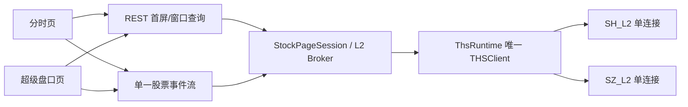

# 个股分时页与超级盘口页实施计划

> 状态：已实施（2026-08-21 前后上线；此后追加：北交所超级盘口形态 2026-09-08、看盘页保活缓存）  
> 编写日期：2026-08-20  
> 目标版本：Web 看盘第二阶段  
> 适用工程：`thspypc` FastAPI 后端 + `web/` React 前端

## 一、目标与边界

在现有“看盘”主页面之外新增两个可独立打开、可通过浏览器前进/后退切换的个股
子页面：

1. **分时页**：复刻同花顺个股分时页面的核心信息密度，包含三阶段分时、均价、
   成交量/大单金额、十档盘口和逐笔成交，并在盘中持续更新。
2. **超级盘口页**：以 4096 盘口快照回放为时间轴，查看任一时刻的十档盘口，结合
   7169 逐笔成交、7173/7174 买一卖一委托队列、7175 挂单和 7170/7171 撤单明细，
   支持实时跟随与历史回看。

本阶段面向桌面端本地工具，默认窗口宽度不小于 1280px。暂不做移动端适配、不复刻
同花顺广告/资讯/诊股模块，也不引入第三方行情作为兜底。所有展示数据仍以仓库已经
验证的同花顺 PC 协议为准。

## 二、已经具备的协议基础

| 页面能力 | 已有接口/协议 | 当前状态 |
|---|---|---|
| 股票首屏行情 | `market_view_fast()` | 已有 quote + 五/十档快照 |
| 三阶段分时 | `intraday()` | 早盘竞价 + 连续交易 + 尾盘竞价已实现 |
| 普通/历史分时 | `timeline()` / `history_timeline()` | 已实现 |
| 十档实时盘口 | `depth_subscribe()`，`0x0f7f` | 沪深盘中已验收 |
| 逐笔成交回放 | `superorder()`，period 7169 | 已实现，按绝对时间区间查询 |
| 逐笔成交推送 | `0x60/0x04` 单笔/批量 | 单笔及8种批量帧均已字段级解码 |
| 盘口快照回放 | `snapshot_replay()`，period 4096 | 约3秒一帧，含完整十档 |
| 买一/卖一队列 | `order_queues()`，7173/7174 | 已实现全量查询 |
| 队列实时更新 | `0x60/0x14` / `0x60/0x18` | 已确认买一/卖一并完成解析 |
| 挂单/撤单明细 | `order_details()`，7175/7170/7171 | 已实现并可通过委托号回连 |
| 撤单实时更新 | `0x60/0x08` / `0x60/0x0c` | 单条与变长批量均已完成解析 |

关键限制：`snapshot_replay()`、`superorder()`、`order_details()`、`order_queues()`
目前在 4214 后台推送线程存活时会抛 `ChannelUnavailableError`，因为请求路径和后台
线程都会读取同一条 SH_L2/SZ_L2 socket。这个限制必须先解决，不能在前端靠重试
掩盖。

## 三、页面入口与公共状态

### 3.1 URL 方案

当前前端没有 React Router，也没有生产环境 SPA fallback。第一版采用 query route，
不增加路由依赖：

- `/?view=kanpan&code=603334`：现有看盘页；
- `/?view=timeline&code=603334`：个股分时页；
- `/?view=superorder&code=603334`：超级盘口页。

顶栏增加“看盘 / 分时 / 超级盘口”三个标签。切页使用 `history.pushState()`，监听
`popstate`，保证浏览器前进、后退和书签可用。`code`、页面类型和超级盘口的日期写入
URL；图表光标、面板宽度、当前 tab 等纯展示状态留在内存或 `localStorage`。

### 3.2 App 重构

`StockProvider` 保持在页面切换器之上，三个页面共享当前代码、股票名称缓存、连接
状态和上下切股逻辑。现有 `App.tsx` 中三栏布局下沉为 `KanpanPage`，避免以后把
三个页面的请求和布局继续堆在一个组件里。

建议目录：

```text
web/src/
├── app/
│   ├── AppShell.tsx
│   ├── route.ts
│   └── AppNav.tsx
├── pages/
│   ├── KanpanPage.tsx
│   ├── TimelinePage.tsx
│   └── SuperorderPage.tsx
├── components/stock/
│   ├── StockHeader.tsx
│   ├── StockStats.tsx
│   └── OrderBook10.tsx
├── components/timeline/
└── components/superorder/
```

## 四、分时页设计

### 4.1 布局

```text
┌ 股票代码/名称/现价/涨跌   看盘 | 分时 | 超级盘口   连接状态 ┐
├──────────────────────────────────────────┬───────────────┤
│ 分时价格 + 均价 + 昨收基准线              │ 股票信息       │
│ 早盘竞价 | 连续交易 | 尾盘竞价            │ 卖十 … 卖一    │
│                                          │ 买一 … 买十    │
├──────────────────────────────────────────┼───────────────┤
│ 成交量 / 大单金额（切换或上下双图）        │ 逐笔成交       │
│                                          │ 时间 价 量 方向 │
└──────────────────────────────────────────┴───────────────┘
```

### 4.2 功能范围

- 沿用当前三阶段分时的真实时间轴和午休压缩逻辑；
- 增加昨收水平线、左右价格/涨跌幅双轴、十字光标和 tooltip；
- 增加分钟成交量副图；有 Level2 字段时增加“大单金额”曲线切换；
- 右栏使用真正的十档盘口，不再只把五档组件拉长；
- 逐笔表初始通过 7169 拉最近窗口，盘中接收 `0x60/0x04` 单笔及批量增量；
- 点击逐笔行时在分时图定位对应时间；
- 支持实时跟随开关。用户拖动/查看历史点时暂停自动滚到最新，点击“回到实时”恢复；
- 切股沿用现有 latest-wins lane，不允许旧股票响应覆盖当前股票；
- 普通账号仍可使用基础分时、五档和分钟量，Level2 专属区域显示清晰的能力提示，
  不能把空数组渲染成“当天无成交”。

### 4.3 数据装载顺序

1. `market_view_fast`：先显示股票信息和盘口骨架；
2. `intraday`：绘制完整三阶段分时；
3. Level2 时查询最近60秒或最近60笔 7169，填充逐笔表；
4. 建立统一股票推送流，合并 trade/depth 事件；
5. 推送断线后保留现有画面，显示“正在重连”，恢复后用7169补缺口并刷新盘口。

## 五、超级盘口页设计

### 5.1 布局

```text
┌ 股票代码/名称/日期/实时跟随   看盘 | 分时 | 超级盘口       ┐
├─────────────────────────────┬──────────────┬───────────────┤
│ 4096价格/量时间轴             │ 光标时刻十档  │ 买一委托队列  │
│ 十字光标 + 回放游标           │ 卖十 … 买十   │ 卖一委托队列  │
│ [◀] [播放] [▶] [时间滑条]     │ 当前/历史标记  │ 总笔数/截断标记│
├─────────────────────────────┴──────────────┴───────────────┤
│ 逐笔成交 | 全部挂单 | 买撤 | 卖撤                           │
│ 时间 方向 价格 数量 委托号 撤单号 存续秒数 关联状态          │
└─────────────────────────────────────────────────────────────┘
```

### 5.2 回放模型

- 4096 全日数据在服务端按 `market/code/trade_date` 缓存；浏览器首先只取轻量索引
  （时间、现价、量、买一、卖一），不直接接收几千条完整十档 JSON；
- 用户移动光标时，由缓存返回最近时刻的一条完整十档快照；光标请求 150ms 防抖、
  latest-wins，避免拖动时生成大量排队查询；
- 播放支持 1×/2×/5×，本质上只移动本地游标，不重复请求同花顺服务器；
- 逐笔和挂撤单明细按可见时间窗加载，默认光标前后30秒，最大单次窗口5分钟；
- 明细表按稳定键去重：成交使用 `(code, seq)`，撤单使用 `(code, cancel_id)`，挂单
  使用 `(code, order_id)`；
- 撤单行显示 `order_id` 与 `linked_order/link_exact`。原挂单不在当前窗口时显示
  “原单在窗口外”，按需扩大查询，不能误报为协议不一致。

### 5.3 委托队列口径

7173/7174 和 `0x14/0x18` 表示当前买一/卖一价位的委托队列：

- `entries` 只是客户端可见窗口，不一定包含该价位全部委托；
- `total_order_count > visible_count` 时必须显示“仅显示前 N / 共 M 笔”；
- `meta_value` 继续按原始辅助值保存，在语义未确认前不标成“总委托量”；
- 历史回放光标处的十档来自4096，不能把“当前7173/7174队列”冒充成任意历史时刻
  的精确队列；非实时光标下队列面板显示“当日最新队列”或暂时收起；
- 当前仅确认最近一个交易日有历史队列。更早日期返回空时应显示协议能力限制。

### 5.4 实时跟随

实时模式下统一合并：

- `depth`：替换当前十档；
- `trade`：追加逐笔，并推进分时/最新价；
- `order_queue`：按 side 替换买一或卖一队列；
- `order_cancel`：追加买撤/卖撤；批量帧在后端展开后逐条发送；
- 发现成交 `seq` 缺口时发送 `resync` 状态，并用7169区间补齐，不猜测缺失成交。

用户离开实时光标后，实时事件仍进入有限缓存但不移动回放游标；点击“回到实时”一次性
切到最新快照和最新队列。

## 六、后端架构

### 6.1 强制约束：一个进程、一个 THSClient、每条 socket 只有一个 reader

不能为两个页面或每个浏览器标签创建新的 `THSClient`，也不能让 REST 请求线程与
推送线程同时 `recv()` 同一 socket。目标结构如下：



实现一个市场 L2 broker，由它独占 SH_L2/SZ_L2 的读取：

1. 所有请求先进入该市场的串行命令队列；
2. broker 发送请求并用 matcher 收集对应 ACK/hd1.0 响应；
3. 等待响应期间遇到 `trade/depth/order_queue/order_cancel` 主动帧，立即转发事件总线；
4. 查询完成后 resolve 调用方 future；超时只结束该请求，不重建第二客户端；
5. 断线由 `ConnectionManager` 受控重建，重连后按引用计数恢复代码注册；
6. 不允许“请求接口失败后偷偷新开 socket”或脚本在 Web 后台存在时回退独立登录。

现有 `ListBucketCoordinator` 已有“等 ACK 时把深度帧交给统一分发器”的雏形，可抽出
通用 matcher/dispatcher，而不是再写一套循环。

### 6.2 统一事件模型

后端向浏览器输出判别联合类型：

```text
trade        code market ts seq price volume direction delegate_a delegate_b
depth        code market ts price bids[10] asks[10] phase
order_queue  code market ts side price total_order_count entries[] truncated
order_cancel code market cancel_id order_id side placed_ts cancelled_ts price volume
status       code state reason last_seq
resync       code from_seq to_seq
```

解析顺序固定为：成交批量 → 成交单笔 → 撤单批量 → 撤单单笔 → 委托队列 → 十档。
`latest_prices` 只能由成交或完整盘口更新，不能被撤单价、买一价、卖一价污染。

### 6.3 新增 Web API

保留现有 `/api/intraday`、`/api/market_view_fast`、`/api/superorder` 和
`/api/order-details`，新增：

| API | 用途 |
|---|---|
| `GET /api/order-queues/{code}` | 7173/7174 一次返回买一和卖一队列 |
| `GET /api/superorder-replay/{code}?trade_date=` | 加载4096并返回轻量时间轴索引 |
| `GET /api/superorder-replay/{code}/snapshot?trade_date=&ts=` | 从服务端缓存返回离 ts 最近的完整十档 |
| `GET /api/superorder-window/{code}?start=&end=` | 串行聚合7169和7175/7170/7171窗口数据 |
| `WS /api/stock-stream/{code}` | 单连接输出 trade/depth/queue/cancel/status 事件 |

约束：

- 日期参数统一使用 `YYYY-MM-DD`，事件时间统一输出 Unix 秒并附 ISO 字符串；
- `superorder-window` 最大5分钟，超出返回400，防止一次生成全天挂单 JSON；
- 4096 原始缓存设置 LRU 上限（建议8个 `code/date`）和交易日失效规则；
- 大响应启用 gzip；协议加载超时使用独立上限，不能套用当前交互接口2秒慢尾；
- WebSocket 只是进程内事件总线的消费者，不触发额外 HTTP 鉴权或8901登录；
- 同代码多个浏览器订阅使用引用计数，只发一次4214注册。

## 七、前端数据层

### 7.1 类型

在 `types.ts` 增加：

- `TradeEvent`、`DepthEvent`、`OrderQueueEvent`、`OrderCancelEvent`；
- `StockStreamEvent` 判别联合；
- `SnapshotReplayIndexPoint`、`SnapshotReplaySnapshot`；
- `SuperorderWindow`、`OrderDetailRow`；
- 页面能力状态 `StockPageCapability`。

### 7.2 hooks 与状态归属

- `useTimelinePage(code)`：管理首屏分时、逐笔初值和实时合并；
- `useSuperorderReplay(code, date)`：管理4096索引、服务端缓存状态和回放游标；
- `useSuperorderWindow(code, cursor)`：防抖加载当前窗口，旧请求结果丢弃；
- `useStockStream(code, channels)`：全页面只建一个 WebSocket，指数退避重连；
- `StockContext` 只保存跨页面公共股票状态，不塞入几千条回放数据；页面大数据在页面
  hook 内持有，切走后按 LRU 策略决定保留或释放。

### 7.3 图表和表格复用

- 把现有 `TimelineChart` 的坐标转换、三阶段拆分提取成纯函数并保留测试；
- `DepthPanel` 改造成接收 props 的 `OrderBook10`，看盘页和两个子页面共用；
- 分时价格/均价/成交量继续使用 ECharts；
- K线组件不进入这两个页面；
- 逐笔、挂单、撤单表采用定高虚拟列表，不能把全天数据全部渲染成 DOM；
- 颜色沿用现有 A 股红涨绿跌变量，方向颜色与价格涨跌颜色分开定义，避免“主动卖”
  被误当成“价格下跌”。

## 八、实施阶段

### 阶段0：契约和回归基线

- [x] 固化上述 REST/WS JSON schema；
- [x] 为 `0x14/0x18`、单/批量撤单、单/批量成交建立统一事件归一测试；
- [x] 加入“队列/撤单价不得更新 latest_price”的回归；
- [ ] 前端加入 Vitest + React Testing Library，先覆盖路由和事件归一纯函数；
- [ ] 记录当前前端构建和 Python 全量测试基线。

验收：所有事件可从真实夹具生成稳定 JSON，现有接口行为不变。

### 阶段1：L2 broker 与页面后端 API

- [x] 抽出单 reader 的请求/推送分流器；
- [x] 将7169、4096、7173–7175查询迁移到 broker；
- [x] 增加 replay 缓存、window 聚合、order-queues 和 WebSocket 路由；
- [x] 增加订阅引用计数、换股、最后订阅释放和断线重注册；
- [x] 用 fake socket 测试响应中夹入各类主动推送时请求仍能完成。

验收：保持 WebSocket 推送时可以连续查询4096/7169/717x，不出现
`ChannelUnavailableError`、双 reader 或额外登录。

### 阶段2：AppShell 与公共组件

- [x] 提取 `KanpanPage`；
- [x] 完成 query route、顶栏 tab、URL/code 同步和 popstate；
- [ ] 提取 `StockHeader`、`StockStats`、`OrderBook10`；
- [ ] 保持现有看盘页布局、拖拽宽度和键盘切股不回退。

验收：三个 URL 可直接打开和前后切换；现有看盘页视觉与功能不变。

### 阶段3：分时页

- [ ] 分时主图、昨收/涨跌幅双轴、量副图和大单金额切换；
- [ ] 十档盘口、逐笔表、点击定位和实时跟随；
- [ ] 普通账号降级、盘外状态、切股 latest-wins；
- [ ] 成交序号缺口自动7169补齐。

验收：沪深各一只股票盘中运行10分钟，价格、十档和逐笔持续更新；切股20次无旧数据
串入、无重复成交。

当前MVP：分时主图、十档、最近两分钟7169逐笔和壳层共享WebSocket已落地；大单金额
切换、逐笔点击联动和seq缺口补齐仍按本阶段清单继续。

### 阶段4：超级盘口页

- [ ] 4096索引图、十字光标、播放控制和服务端快照缓存；
- [ ] 光标时刻十档、逐笔窗口、挂单/买撤/卖撤 tabs；
- [ ] 买一/卖一队列总笔数、可见笔数、大单标记和截断提示；
- [ ] 实时模式合并 `0x14/0x18` 和单/批量撤单；
- [ ] 历史队列限制、窗口外原单、指数/北交所不支持状态明确展示。

验收：用603334 2026-08-20 13:17–13:20真值回放，至少核对两条批量卖撤
3477/3478、对应原委托号、价格、数量和时间均与页面一致。

当前MVP：4096索引图、光标完整十档、7169/717x窗口、买卖一队列及实时事件合并
已经接通；播放控制、窗口外原单提示和指定13:17–13:20页面逐项验收尚未完成。

### 阶段5：稳定性与交付

- [ ] WebSocket 断线、后台重启、午休、收盘、空数据和权限错误状态；
- [ ] 缓存上限、虚拟列表、gzip和大数据内存检查；
- [ ] 更新 `web/README.md`、功能路线图和交接文档；
- [ ] 增加活网脚本 `verify_stock_pages_live.py`，只访问共享 Web 后台，不创建独立
  `THSClient`。

验收：Python 全量测试、`pnpm build`、前端组件测试和沪深盘中活网脚本全部通过。

## 九、测试矩阵

| 层级 | 必测内容 |
|---|---|
| 协议单测 | 单/批量成交、单/批量撤单、买卖队列、70/71与87/88字节口径 |
| Broker 单测 | ACK前插入推送、响应分片、超时、断线、重注册、引用计数、无重复登录 |
| API 单测 | 日期/窗口校验、Level2权限、缓存命中、JSON去除raw bytes、WS事件schema |
| 前端单测 | 时间轴转换、事件去重、seq缺口、旧股票响应丢弃、历史队列提示 |
| 组件测试 | 三页路由、tab/back-forward、实时暂停/恢复、虚拟表格、错误状态 |
| 离线端到端 | 使用 `kanpan_push_20260820_131534.pcap` 和现有真实夹具回放 |
| 活网验收 | 600519 + 000001，各10分钟；分时、十档、成交、队列、撤单及切股 |

## 十、风险与明确决策

1. **socket 读竞争是第一风险**：不完成 broker 就不接 WebSocket；禁止用第二
   `THSClient` 绕过。
2. **4096 JSON 体积大**：服务端缓存完整记录，浏览器只取索引和光标快照。
3. **挂撤单窗口可能缺原单**：展示窗口外状态，不能把 `linked_order=false` 解释为
   数据错误。
4. **历史委托队列能力有限**：不宣称能还原任意历史秒的完整买一/卖一排队顺序。
5. **实时事件可能乱序或重复**：按稳定键去重，成交 seq 缺口必须用7169校准。
6. **普通账号边界**：分时页可降级；超级盘口明确标为 Level2 专属，不自动换数据源。
7. **快速切股**：所有大查询使用 per-lane latest-wins；浏览器取消只代表结果作废，
   不能让底层 socket 半帧中断。

## 十一、完成定义

只有同时满足以下条件才算完成：

- 两个子页面均有可书签 URL，和现有看盘页共享选股与连接状态；
- 分时页具备首屏、历史曲线、十档、逐笔和盘中增量；
- 超级盘口页具备4096回放、光标十档、7169、7173–7175及实时挂撤单增量；
- 页面明确展示权限、实时/历史、队列截断和窗口外原单状态，不误导数据口径；
- 全流程只复用 `ThsRuntime` 的唯一 `THSClient`，不存在重复登录和双 reader；
- 沪深盘中验收、离线真值回放、Python全量测试和前端构建全部通过。
